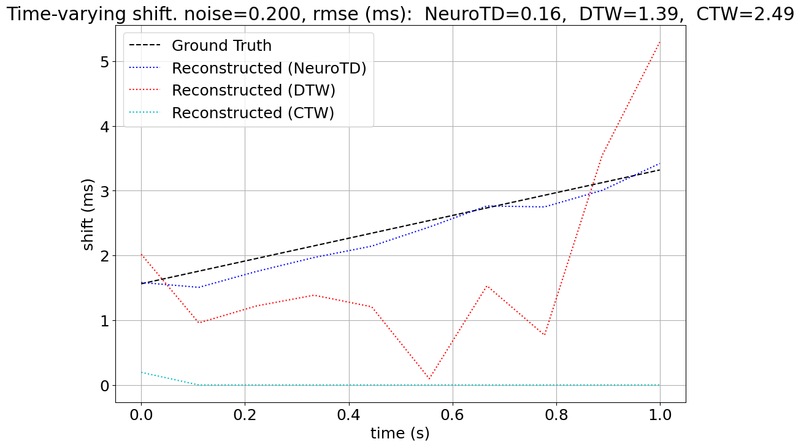

# NeuroTD: NeuroTD: A Time-Frequency Based Multimodal Learning Approach to Analyze Time Delays in Neural Activities

NeuroTD is a deep learning model designed to infer time delays within neural activity data by mapping multimodal
time-series into a common latent space. By applying Siamese neural networks and frequency domain transformations,
NeuroTD enables robust alignment and analysis of neural activity data.


_Figure 1_: NeuroTD uses a Siamese neural network and frequency transformations to align multimodal time-series data. Three steps are shown: (1) extracting core features from two time-series inputs in a shared latent space, (2) transforming data into the frequency domain, and (3) calculating phase differences to infer time delays.

## Installation Instructions (Ubuntu 22.04, WSL 2.0 in Windows 10/11 Pro)

First, clone and navigate to the repository.

```bash
git clone https://github.com/daifengwanglab/NeuroTD
cd NeuroTD
```

This process can take several minutes, depending on network speed.

Create and activate a virtual environment using python 3.11 with `conda`,

```python
# conda (python 3.11)
conda create -n NeuroTD python=3.11
conda activate NeuroTD
```

Install dependencies and the local library with `pip`.

```bash
pip install -r requirements.txt
```

This process usually takes several minutes.

## Usage

### Example: Simulation Comparison

```python
import numpy as np
from simulation import Simulation

# Define the time-varying, shifts for the simulation in seconds
shifts = np.linspace(1.56e-3, 3.32e-3, 10)

# Initialize the Simulation instance with desired parameters: total 1s, 5120 Hz, 10 shifts
delay_simulation = Simulation(time=1, sampling_rate=5120, shifts=shifts, noise_std=0.20, shape='default')

# Add methods for comparison, such as 'dtw' and 'ctw'
delay_simulation.add_comparison(['dtw', 'ctw'])

# Run the simulation
delay_simulation.run_simulation()

# Display the results of the simulation
delay_simulation.display_results()
```



<!-- ## Citations

If you use NeuroTD in your research, please cite our paper:

Xiang Huang, Noah Cohen Kalafut, Sayali Alatkar, Athan Z. Li, Qiping Dong, Qiang Chang, and Daifeng Wang, NeuroTD: A Time-Frequency Based Multimodal Learning Approach to Analyze Time Delays in Neural Activities. -->
